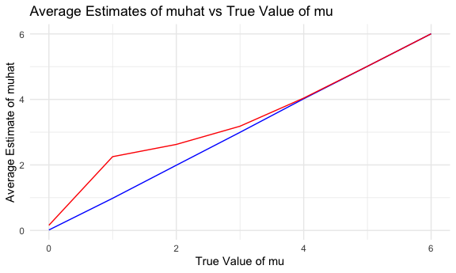
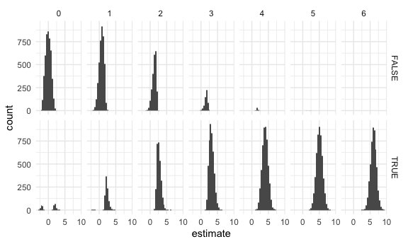

p8105_hw5_zl2746
================
Ze Li
2023-11-08

## Problem 1

``` r
homicide_df = read.csv("data/homicide-data.csv")
```

- Describe the raw data.

  There are 52179 observations with 12 variables in this data set. The
  variables are uid, reported_date, victim_last, victim_first,
  victim_race, victim_age, victim_sex, city, state, lat, lon,
  disposition.

- Create a city_state variable (e.g. “Baltimore, MD”) and

- then summarize within cities to obtain the total number of homicides
  and the number of unsolved homicides (those for which the disposition
  is “Closed without arrest” or “Open/No arrest”).

``` r
homicide1 = 
  homicide_df |>
  unite(city_state,c(city,state),sep = ', ')

city_summary <- 
  homicide1 |>
  group_by(city_state) |>
  summarize(
    total_homicides = n(),
    unsolved_homicides = sum(disposition %in% c("Closed without arrest", "Open/No arrest"))
  )
city_summary
```

    ## # A tibble: 51 × 3
    ##    city_state      total_homicides unsolved_homicides
    ##    <chr>                     <int>              <int>
    ##  1 Albuquerque, NM             378                146
    ##  2 Atlanta, GA                 973                373
    ##  3 Baltimore, MD              2827               1825
    ##  4 Baton Rouge, LA             424                196
    ##  5 Birmingham, AL              800                347
    ##  6 Boston, MA                  614                310
    ##  7 Buffalo, NY                 521                319
    ##  8 Charlotte, NC               687                206
    ##  9 Chicago, IL                5535               4073
    ## 10 Cincinnati, OH              694                309
    ## # ℹ 41 more rows

- For the city of Baltimore, MD, use the prop.test function to estimate
  the proportion of homicides that are unsolved; save the output of
  prop.test as an R object, apply the broom::tidy to this object and
  pull the estimated proportion and confidence intervals from the
  resulting tidy dataframe.

``` r
baltimore_data = filter(homicide1, city_state == "Baltimore, MD")
baltimore_test = prop.test(x = sum(baltimore_data$Disposition %in% c("Closed without arrest", "Open/No arrest")),
                            n = nrow(baltimore_data))
baltimore_tidy = tidy(baltimore_test)
baltimore_test
```

    ## 
    ##  1-sample proportions test with continuity correction
    ## 
    ## data:  sum(baltimore_data$Disposition %in% c("Closed without arrest", "Open/No arrest")) out of nrow(baltimore_data), null probability 0.5
    ## X-squared = 2825, df = 1, p-value < 2.2e-16
    ## alternative hypothesis: true p is not equal to 0.5
    ## 95 percent confidence interval:
    ##  0.000000000 0.001691789
    ## sample estimates:
    ## p 
    ## 0

``` r
baltimore_tidy
```

    ## # A tibble: 1 × 8
    ##   estimate statistic p.value parameter conf.low conf.high method     alternative
    ##      <dbl>     <dbl>   <dbl>     <int>    <dbl>     <dbl> <chr>      <chr>      
    ## 1        0     2825.       0         1        0   0.00169 1-sample … two.sided

- Now run prop.test for each of the cities in your dataset, and extract
  both the proportion of unsolved homicides and the confidence interval
  for each. Do this within a “tidy” pipeline, making use of purrr::map,
  purrr::map2, list columns and unnest as necessary to create a tidy
  dataframe with estimated proportions and CIs for each city.

``` r
prop_test_results =
  city_summary |>
  mutate(test_result = map2(unsolved_homicides, total_homicides, ~prop.test(x = .x, n = .y))) |>
  mutate(tidy_result = map(test_result, tidy)) |>
  unnest(tidy_result)
prop_test_results
```

    ## # A tibble: 51 × 12
    ##    city_state  total_homicides unsolved_homicides test_result estimate statistic
    ##    <chr>                 <int>              <int> <list>         <dbl>     <dbl>
    ##  1 Albuquerqu…             378                146 <htest>        0.386   19.1   
    ##  2 Atlanta, GA             973                373 <htest>        0.383   52.5   
    ##  3 Baltimore,…            2827               1825 <htest>        0.646  239.    
    ##  4 Baton Roug…             424                196 <htest>        0.462    2.27  
    ##  5 Birmingham…             800                347 <htest>        0.434   13.8   
    ##  6 Boston, MA              614                310 <htest>        0.505    0.0407
    ##  7 Buffalo, NY             521                319 <htest>        0.612   25.8   
    ##  8 Charlotte,…             687                206 <htest>        0.300  109.    
    ##  9 Chicago, IL            5535               4073 <htest>        0.736 1231.    
    ## 10 Cincinnati…             694                309 <htest>        0.445    8.11  
    ## # ℹ 41 more rows
    ## # ℹ 6 more variables: p.value <dbl>, parameter <int>, conf.low <dbl>,
    ## #   conf.high <dbl>, method <chr>, alternative <chr>

- Create a plot that shows the estimates and CIs for each city – check
  out geom_errorbar for a way to add error bars based on the upper and
  lower limits. Organize cities according to the proportion of unsolved
  homicides.

``` r
prop_test_results |>
  ggplot(aes(x = reorder(city_state, estimate), y = estimate)) +
  geom_point() +
  geom_errorbar(aes(ymin = conf.low, ymax = conf.high)) +
  coord_flip() +
  labs(title = "Proportion of Unsolved Homicides by City",
       x = "City",
       y = "Proportion of Unsolved Homicides")
```


## Problem 2

- Create a tidy dataframe containing data from all participants,
  including the subject ID, arm, and observations over time:
  - Start with a dataframe containing all file names; the list.files
    function will help
  - Iterate over file names and read in data for each subject using
    purrr::map and saving the result as a new variable in the dataframe
    \*Tidy the result; manipulate file names to include control arm and
    subject ID, make sure weekly observations are “tidy”, and do any
    other tidying that’s necessary

``` r
fulldata = 
  tibble(
    filename = list.files("./data2", pattern = ".csv"),
    path = str_c("./data2/",filename)
  ) |>
  mutate(data = map(path, ~read_csv(.x))) |>
  unnest() |>
  select(starts_with("week"))
```

    ## Rows: 1 Columns: 8
    ## ── Column specification ────────────────────────────────────────────────────────
    ## Delimiter: ","
    ## dbl (8): week_1, week_2, week_3, week_4, week_5, week_6, week_7, week_8
    ## 
    ## ℹ Use `spec()` to retrieve the full column specification for this data.
    ## ℹ Specify the column types or set `show_col_types = FALSE` to quiet this message.
    ## Rows: 1 Columns: 8
    ## ── Column specification ────────────────────────────────────────────────────────
    ## Delimiter: ","
    ## dbl (8): week_1, week_2, week_3, week_4, week_5, week_6, week_7, week_8
    ## 
    ## ℹ Use `spec()` to retrieve the full column specification for this data.
    ## ℹ Specify the column types or set `show_col_types = FALSE` to quiet this message.
    ## Rows: 1 Columns: 8
    ## ── Column specification ────────────────────────────────────────────────────────
    ## Delimiter: ","
    ## dbl (8): week_1, week_2, week_3, week_4, week_5, week_6, week_7, week_8
    ## 
    ## ℹ Use `spec()` to retrieve the full column specification for this data.
    ## ℹ Specify the column types or set `show_col_types = FALSE` to quiet this message.
    ## Rows: 1 Columns: 8
    ## ── Column specification ────────────────────────────────────────────────────────
    ## Delimiter: ","
    ## dbl (8): week_1, week_2, week_3, week_4, week_5, week_6, week_7, week_8
    ## 
    ## ℹ Use `spec()` to retrieve the full column specification for this data.
    ## ℹ Specify the column types or set `show_col_types = FALSE` to quiet this message.
    ## Rows: 1 Columns: 8
    ## ── Column specification ────────────────────────────────────────────────────────
    ## Delimiter: ","
    ## dbl (8): week_1, week_2, week_3, week_4, week_5, week_6, week_7, week_8
    ## 
    ## ℹ Use `spec()` to retrieve the full column specification for this data.
    ## ℹ Specify the column types or set `show_col_types = FALSE` to quiet this message.
    ## Rows: 1 Columns: 8
    ## ── Column specification ────────────────────────────────────────────────────────
    ## Delimiter: ","
    ## dbl (8): week_1, week_2, week_3, week_4, week_5, week_6, week_7, week_8
    ## 
    ## ℹ Use `spec()` to retrieve the full column specification for this data.
    ## ℹ Specify the column types or set `show_col_types = FALSE` to quiet this message.
    ## Rows: 1 Columns: 8
    ## ── Column specification ────────────────────────────────────────────────────────
    ## Delimiter: ","
    ## dbl (8): week_1, week_2, week_3, week_4, week_5, week_6, week_7, week_8
    ## 
    ## ℹ Use `spec()` to retrieve the full column specification for this data.
    ## ℹ Specify the column types or set `show_col_types = FALSE` to quiet this message.
    ## Rows: 1 Columns: 8
    ## ── Column specification ────────────────────────────────────────────────────────
    ## Delimiter: ","
    ## dbl (8): week_1, week_2, week_3, week_4, week_5, week_6, week_7, week_8
    ## 
    ## ℹ Use `spec()` to retrieve the full column specification for this data.
    ## ℹ Specify the column types or set `show_col_types = FALSE` to quiet this message.
    ## Rows: 1 Columns: 8
    ## ── Column specification ────────────────────────────────────────────────────────
    ## Delimiter: ","
    ## dbl (8): week_1, week_2, week_3, week_4, week_5, week_6, week_7, week_8
    ## 
    ## ℹ Use `spec()` to retrieve the full column specification for this data.
    ## ℹ Specify the column types or set `show_col_types = FALSE` to quiet this message.
    ## Rows: 1 Columns: 8
    ## ── Column specification ────────────────────────────────────────────────────────
    ## Delimiter: ","
    ## dbl (8): week_1, week_2, week_3, week_4, week_5, week_6, week_7, week_8
    ## 
    ## ℹ Use `spec()` to retrieve the full column specification for this data.
    ## ℹ Specify the column types or set `show_col_types = FALSE` to quiet this message.
    ## Rows: 1 Columns: 8
    ## ── Column specification ────────────────────────────────────────────────────────
    ## Delimiter: ","
    ## dbl (8): week_1, week_2, week_3, week_4, week_5, week_6, week_7, week_8
    ## 
    ## ℹ Use `spec()` to retrieve the full column specification for this data.
    ## ℹ Specify the column types or set `show_col_types = FALSE` to quiet this message.
    ## Rows: 1 Columns: 8
    ## ── Column specification ────────────────────────────────────────────────────────
    ## Delimiter: ","
    ## dbl (8): week_1, week_2, week_3, week_4, week_5, week_6, week_7, week_8
    ## 
    ## ℹ Use `spec()` to retrieve the full column specification for this data.
    ## ℹ Specify the column types or set `show_col_types = FALSE` to quiet this message.
    ## Rows: 1 Columns: 8
    ## ── Column specification ────────────────────────────────────────────────────────
    ## Delimiter: ","
    ## dbl (8): week_1, week_2, week_3, week_4, week_5, week_6, week_7, week_8
    ## 
    ## ℹ Use `spec()` to retrieve the full column specification for this data.
    ## ℹ Specify the column types or set `show_col_types = FALSE` to quiet this message.
    ## Rows: 1 Columns: 8
    ## ── Column specification ────────────────────────────────────────────────────────
    ## Delimiter: ","
    ## dbl (8): week_1, week_2, week_3, week_4, week_5, week_6, week_7, week_8
    ## 
    ## ℹ Use `spec()` to retrieve the full column specification for this data.
    ## ℹ Specify the column types or set `show_col_types = FALSE` to quiet this message.
    ## Rows: 1 Columns: 8
    ## ── Column specification ────────────────────────────────────────────────────────
    ## Delimiter: ","
    ## dbl (8): week_1, week_2, week_3, week_4, week_5, week_6, week_7, week_8
    ## 
    ## ℹ Use `spec()` to retrieve the full column specification for this data.
    ## ℹ Specify the column types or set `show_col_types = FALSE` to quiet this message.
    ## Rows: 1 Columns: 8
    ## ── Column specification ────────────────────────────────────────────────────────
    ## Delimiter: ","
    ## dbl (8): week_1, week_2, week_3, week_4, week_5, week_6, week_7, week_8
    ## 
    ## ℹ Use `spec()` to retrieve the full column specification for this data.
    ## ℹ Specify the column types or set `show_col_types = FALSE` to quiet this message.
    ## Rows: 1 Columns: 8
    ## ── Column specification ────────────────────────────────────────────────────────
    ## Delimiter: ","
    ## dbl (8): week_1, week_2, week_3, week_4, week_5, week_6, week_7, week_8
    ## 
    ## ℹ Use `spec()` to retrieve the full column specification for this data.
    ## ℹ Specify the column types or set `show_col_types = FALSE` to quiet this message.
    ## Rows: 1 Columns: 8
    ## ── Column specification ────────────────────────────────────────────────────────
    ## Delimiter: ","
    ## dbl (8): week_1, week_2, week_3, week_4, week_5, week_6, week_7, week_8
    ## 
    ## ℹ Use `spec()` to retrieve the full column specification for this data.
    ## ℹ Specify the column types or set `show_col_types = FALSE` to quiet this message.
    ## Rows: 1 Columns: 8
    ## ── Column specification ────────────────────────────────────────────────────────
    ## Delimiter: ","
    ## dbl (8): week_1, week_2, week_3, week_4, week_5, week_6, week_7, week_8
    ## 
    ## ℹ Use `spec()` to retrieve the full column specification for this data.
    ## ℹ Specify the column types or set `show_col_types = FALSE` to quiet this message.
    ## Rows: 1 Columns: 8
    ## ── Column specification ────────────────────────────────────────────────────────
    ## Delimiter: ","
    ## dbl (8): week_1, week_2, week_3, week_4, week_5, week_6, week_7, week_8
    ## 
    ## ℹ Use `spec()` to retrieve the full column specification for this data.
    ## ℹ Specify the column types or set `show_col_types = FALSE` to quiet this message.

``` r
filename = list.files("./data2", pattern = ".csv")
subject_id = str_extract(basename(filename), "\\d+") 
arm = ifelse(str_detect(basename(filename), "con"), "Control", "Experimental")
subjectinfo = tibble(SubjectID = subject_id,Arm = arm)
combinedata = bind_cols(subjectinfo,fulldata)
combinedata
```

    ## # A tibble: 20 × 10
    ##    SubjectID Arm         week_1 week_2 week_3 week_4 week_5 week_6 week_7 week_8
    ##    <chr>     <chr>        <dbl>  <dbl>  <dbl>  <dbl>  <dbl>  <dbl>  <dbl>  <dbl>
    ##  1 01        Control       0.2   -1.31   0.66   1.96   0.23   1.09   0.05   1.94
    ##  2 02        Control       1.13  -0.88   1.07   0.17  -0.83  -0.31   1.58   0.44
    ##  3 03        Control       1.77   3.11   2.22   3.26   3.31   0.89   1.88   1.01
    ##  4 04        Control       1.04   3.66   1.22   2.33   1.47   2.7    1.87   1.66
    ##  5 05        Control       0.47  -0.58  -0.09  -1.37  -0.32  -2.17   0.45   0.48
    ##  6 06        Control       2.37   2.5    1.59  -0.16   2.08   3.07   0.78   2.35
    ##  7 07        Control       0.03   1.21   1.13   0.64   0.49  -0.12  -0.07   0.46
    ##  8 08        Control      -0.08   1.42   0.09   0.36   1.18  -1.16   0.33  -0.44
    ##  9 09        Control       0.08   1.24   1.44   0.41   0.95   2.75   0.3    0.03
    ## 10 10        Control       2.14   1.15   2.52   3.44   4.26   0.97   2.73  -0.53
    ## 11 01        Experiment…   3.05   3.67   4.84   5.8    6.33   5.46   6.38   5.91
    ## 12 02        Experiment…  -0.84   2.63   1.64   2.58   1.24   2.32   3.11   3.78
    ## 13 03        Experiment…   2.15   2.08   1.82   2.84   3.36   3.61   3.37   3.74
    ## 14 04        Experiment…  -0.62   2.54   3.78   2.73   4.49   5.82   6      6.49
    ## 15 05        Experiment…   0.7    3.33   5.34   5.57   6.9    6.66   6.24   6.95
    ## 16 06        Experiment…   3.73   4.08   5.4    6.41   4.87   6.09   7.66   5.83
    ## 17 07        Experiment…   1.18   2.35   1.23   1.17   2.02   1.61   3.13   4.88
    ## 18 08        Experiment…   1.37   1.43   1.84   3.6    3.8    4.72   4.68   5.7 
    ## 19 09        Experiment…  -0.4    1.08   2.66   2.7    2.8    2.64   3.51   3.27
    ## 20 10        Experiment…   1.09   2.8    2.8    4.3    2.25   6.57   6.09   4.64

``` r
combined_data1 = 
  combinedata |>
  pivot_longer(
    week_1:week_8, 
    names_to = "week",
    values_to = "observations_over_time"
  )
combined_data1
```

    ## # A tibble: 160 × 4
    ##    SubjectID Arm     week   observations_over_time
    ##    <chr>     <chr>   <chr>                   <dbl>
    ##  1 01        Control week_1                   0.2 
    ##  2 01        Control week_2                  -1.31
    ##  3 01        Control week_3                   0.66
    ##  4 01        Control week_4                   1.96
    ##  5 01        Control week_5                   0.23
    ##  6 01        Control week_6                   1.09
    ##  7 01        Control week_7                   0.05
    ##  8 01        Control week_8                   1.94
    ##  9 02        Control week_1                   1.13
    ## 10 02        Control week_2                  -0.88
    ## # ℹ 150 more rows

- Make a spaghetti plot showing observations on each subject over time,
  and comment on differences between groups.

``` r
spaghetti_plot =
  ggplot(combined_data1, 
         aes(x = week, 
             y = observations_over_time, 
             group = SubjectID, 
             color = Arm)) +
  geom_line() +
  theme_minimal() +
  facet_grid(. ~ Arm) +
  labs(title = "Spaghetti Plot of Observations Over Time",
       x = "Time",
       y = "Measurement",
       color = "Subject ID")

spaghetti_plot
```


``` r
ggsave("spaghetti_plot.jpg")
```

    ## Saving 6 x 3.6 in image

## Problem 3

- Set μ=0. Generate 5000 datasets from the normal distribution.

- For each dataset, save μ̂ and the p-value arising from a test of H:μ=0
  using α=0.05. Hint: to obtain the estimate and p-value, use
  broom::tidy to clean the output of t.test

``` r
set.seed(12345)

sim_t_test = function(mu = mu) {
  
  x_vec = rnorm(n = 30, mean = mu, sd = 5)
  t_result <- t.test(x_vec, alternative = "two.sided", conf.level = 0.95)
  tidy(t_result)
  
}

output = vector("list", length = 5000)

for (i in 1:5000) {
  
  output[[i]] = sim_t_test(mu = 0)
  
}

mu0_results = 
  bind_rows(output)
```

- Repeat the above for μ={1,2,3,4,5,6}
  - Make a plot showing the proportion of times the null was rejected
    (the power of the test) on the y axis and the true value of μ on the
    x axis. Describe the association between effect size and power.

``` r
sim_result_df =
  expand_grid(
    mu = 1:6,
    iter = 1:5000
  ) |> 
  mutate(estimate_df = map(mu, ~sim_t_test(.x))) |> 
  unnest(estimate_df)
sim_result_df
```

    ## # A tibble: 30,000 × 10
    ##       mu  iter estimate statistic p.value parameter conf.low conf.high method   
    ##    <int> <int>    <dbl>     <dbl>   <dbl>     <dbl>    <dbl>     <dbl> <chr>    
    ##  1     1     1   -0.913    -1.13   0.267         29   -2.56      0.736 One Samp…
    ##  2     1     2    1.51      1.46   0.156         29   -0.612     3.64  One Samp…
    ##  3     1     3    1.51      1.47   0.153         29   -0.592     3.61  One Samp…
    ##  4     1     4    0.802     0.969  0.341         29   -0.892     2.50  One Samp…
    ##  5     1     5    2.01      2.46   0.0203        29    0.336     3.68  One Samp…
    ##  6     1     6    1.05      1.52   0.140         29   -0.368     2.48  One Samp…
    ##  7     1     7   -0.923    -1.21   0.234         29   -2.48      0.631 One Samp…
    ##  8     1     8   -0.261    -0.347  0.731         29   -1.80      1.28  One Samp…
    ##  9     1     9    0.882     1.02   0.315         29   -0.881     2.64  One Samp…
    ## 10     1    10    0.472     0.479  0.636         29   -1.54      2.49  One Samp…
    ## # ℹ 29,990 more rows
    ## # ℹ 1 more variable: alternative <chr>

``` r
power_df =
  sim_result_df |>
  group_by(mu) |>
  summarize(power = mean(p.value < 0.05)) |>
  ggplot(aes(x = mu,y = power)) +
  geom_path() +
  labs(title = "Power of the Test vs. True Value of mu",
       x = "True Value of mu",
       y = "Power of the Test")
power_df
```


``` r
ggsave("Power of the Test vs. True Value of mu.jpg")
```

    ## Saving 6 x 3.6 in image

The power increases when the effect size of $\mu$ increases.

- Make a plot showing the average estimate of μ̂ on the y axis and the
  true value of μ on the x axis.
- Make a second plot (or overlay on the first) the average estimate of μ̂
  only in samples for which the null was rejected on the y axis and the
  true value of μ on the x axis. Is the sample average of μ̂ across tests
  for which the null is rejected approximately equal to the true value
  of μ? Why or why not?

``` r
avg_estimates = 
  sim_result_df |>
  group_by(mu) |>
  summarize(avg_mu_hat_all = mean(estimate), 
            avg_mu_hat_rejected = mean(estimate[p.value < 0.05]))
avg_estimates
```

    ## # A tibble: 6 × 3
    ##      mu avg_mu_hat_all avg_mu_hat_rejected
    ##   <int>          <dbl>               <dbl>
    ## 1     1           1.01                2.27
    ## 2     2           1.98                2.63
    ## 3     3           2.99                3.20
    ## 4     4           4.00                4.02
    ## 5     5           5.02                5.02
    ## 6     6           6.01                6.01

``` r
# Plotting the average estimates
avg_estimate_plot = 
  avg_estimates |>
  ggplot(aes(x = mu)) +
  geom_line(aes(y = avg_mu_hat_all), color = "blue") +
  geom_line(aes(y = avg_mu_hat_rejected), color = "red") +
  labs(title = "Average Estimates of muhat vs True Value of mu",
       x = "True Value of mu",
       y = "Average Estimate of muhat") +
  scale_color_manual(values = c("blue", "red")) +
  theme_minimal()
avg_estimate_plot
```



``` r
ggsave("The average estimates plot.jpg")
```

    ## Saving 6 x 3.6 in image

``` r
sim_result_df |>
  ggplot(aes(x = estimate))+ 
  geom_histogram() +
  facet_grid(p.value < 0.05 ~ mu)
```

    ## `stat_bin()` using `bins = 30`. Pick better value with `binwidth`.


